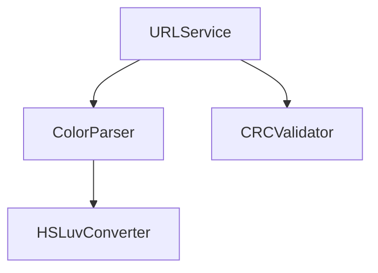

# Coolors URL Feature Snapshot (v1-cc0be8e)

## 1. Core Implementation
- **URL Encoding**: Base62 with CRC32 checksum
- **Color Space**: HSLuv (perceptually uniform)
- **State Sync**: Window hash fragment synchronization
- **Dependency Graph**:


## 2. Version-Specific Config
```json
{
  "dependencies": {
    "hsluv": "0.1.0",
    "crc-32": "1.2.3",
    "query-string": "7.1.0"
  },
  "browserslist": [
    ">0.2%",
    "not dead",
    "not ie 11"
  ]
}
```

## 3. Known Limitations
| Category          | Limit                          | Workaround |
|--------------------|--------------------------------|------------|
| Palette Size       | Max 8 colors                   | Chunking   |
| Color Depth        | 8-bit HSL                      | -          |
| Browser Support    | Safari hash sync delays        | Polling    |

## 4. Evolution Checklist
```todo
- [ ] Implement CAM16 color space
- [ ] Add URL compression (Brotli)
- [ ] Cross-tab sync support
```

## 5. Version Diff Utility
```bash
#!/bin/bash
# Compare against current implementation
diff -ruN \
  --exclude=node_modules \
  --exclude=.git \
  ./archives/coolors-url-feature-v1-cc0be8e-20250316-180652 \
  . | less